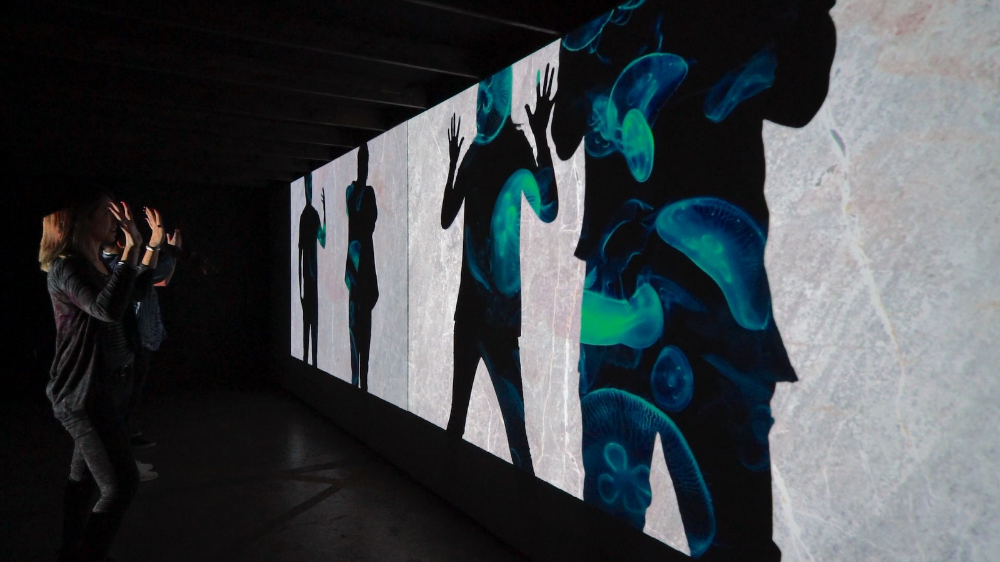

# Create a shadow wall!

Take a look at the sony shadow wall displayed at the 2019 Siggraph conference. 

[https://www.sonycsl.co.jp/tokyo/8371/](https://www.sonycsl.co.jp/tokyo/8371/)

Starting from the frame differencing patch in the shadow_walls folder create a projection that composites 2 videos (or still images, but videos are much cooler) with the shadow mask so that within the body's shadow is one video and outside the shadow is another.  See the reference photo below.

Steps to completion:

1) Uses a camera to create a shadow of a human form live. (many methods were discussed in class. Feel free to use the admittedly imperfect patch we were building in class - link below)
2) Use the shadow mask created above to cut out of video-1. This can be done using the methods we've talked about in class including *, and/or alpha channels, masking and blending on either the CPU or GPU.
3) layer this on top of video-2 as a background.

_extra challenges_

4) for an extra challenge, can you make a duplicate shadow with it's own video-3 which is slightly to the right and behind the original shadow video?
5) create colored shapes that move around the projection on top of, or behind the shadow? 

[Starting Patch](shadow_walls/shadow_mask_start.maxpat)

### Reference photo:

### Bibliography & Techniques

Know the definitions of each of these techniques, and how to implement them. Many times there is a way to implement it on a matrix on the CPU as well as as a texture or geometry on the GPU. Both are useful.

- frame differencing
- Masking
- alpha channel (what layer is the alpha channel?)
- alpha blending 
- alpha mask 
- video plane
- luminosity
