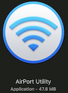

# Network Setup

We're going to discuss the network in terms of connecting things via node and websockets.  Be aware that this uses TCP and Port 80 to communicate in the standard fashion. As this is standard web traffic, this is almost always open and bypasses a lot of the intracacies of firewalls, port forwarding, and the like.  If you decide to use another protocol: OSC via UDP, self defined ports, ssh, etc. there will be some more fiddly settings to deal with. I'll try to note them when they come up. 

There are possibly hundreds of types of entities you may want to network. We'll discuss those below.

__Local Hardwired__ 
Router on site

1) A local computer acting as a server [max, node, processing, etc.]
2) a local wired device acting as a client like a raspberry-pi [installation, display rendering computer, etc.]

__Local Wireless__ 
wireless router on site

3) a local wireless device like an iPad [audience members]
4) a local wireless device like a phone that has cell service [audience members ]

__Wide Area Network__
ISPs providing [DSL, cable, dish]
Cell service with Data plans connected to the WAN

5) computers on the wired internet [offsite viewers or interactions]
6) Cell phones on the Cell Network [offsite audience or members who don't have access to the local network]
7) IOT [installation or iot devices that are on networks outside the control of you]
8) Server in the cloud [perhaps a node app or other service hosted in the cloud that you need access to]

As you work your way out from the locally hosted machine, the networking issues become tiered, adding complexity because each simple, individual setup must be traversed appropriately and not conflicting with a network setting down the line.  For instance, if your ISP blocks all network ports except 8000-8010 and your node app runs on port 7575, you will not be able to connect to it outside of the local network – this is the case with LSU where only certain ports are passed through. (grok DMZ open ports)

A local 

# Apple Airport Router

As opposed to most routers which provide administrative access through the router address (192.168.0.1 or 10.0.1.1 or ...) apple airports are administered through the Airport Utility found in Applications/Utilities on modern MacOSX. 



We are using the following setup in class
```
router name: test1 or test2
password: testtest
```

## Base Station

Name of the Device and hence the Local Network. Set a memorable, not guessable Password... do not leave it at the default.

_Allow setup over WAN should only be enabled when necessary_

Back to My Mac: you can log in via your Mac account. If the device is connected to the WAN (internet) it will be available for you to log in to from afar.

## Internet

For connecting to the Wide Area Network - WAN.  This is the way that the router connects to the internet.  Typically it would be through a cable modem, T1 line, or other Internet provider's device.  Using DHCP, it would be assigned an IP address on their network. This would then be able to be connected to from the outside world.

Connect using DHCP (dynamically assigned addresses), static (you set the IP Address), PPPoE (Point-to-Point Protocol over Ethernet is for non-dynamic internet connections - e.g. username & password, not dynamic connections)

IPv4 Address: 169.254.12.140
Subnet Mask: 255.255.255.0
Router Address: 192.168.0.254

DNS Servers: typically provided by your host
IPv6 DNS Servers: same but for IPv6 addresses
Domain Name: 
IPv6 Address:  Assigned if using

__Internet Options__

Configure IPv6 – Link-local only, Automatically, Manually

use dynamic global hostname...?

## Wireless Tab

Create a wireless network, Extend a wireless network

Wireless Network Name: 

Wireless Security: None, WEP, WPA/WPA2 Personal, WPA/WPA2 Enterprise

how do you want people to connect?

__Wireless Options__
Region...

Create hidden network: Is not advertised and must be joined by name specifically

Radio Mode: a/c, n, g, b, a (in lowering level of quality)

Radio Channel: Automatic

## Network Tab

Router Modes: DHCP & NAT, DHCP only, Bridge Mode

DHCP Range: range of IP Addresses to assign to devices that connect

DHCP Reservations: IP addresses that are assigned to a specific device MAC Address e.g. 42:65:bb:21:0e:e6 => 10.0.1.201  (May also be assigned to a Device-Client-ID)

Port Forwarding: assigning any communication on a specific port to be sent to another port on a different IP address.  e.g. 10.0.1.30:7575 => 10.0.1.202:3000  This can be via UDP or TCP specifically and allows for public facing IPs & ports to be sent to private computers and Ports.

__Network Options__

Assign how long a DHCP address will be leased before having to be renewed. e.g. available for reassignment. You can also set the DHCP range of IP addresses

## Disks

If you have a USB port, networked drive, or an onboard hard drive, you can set up access here. 


## Terminology

- WAN 
- LAN 
- Wireless Network 

- DHCP
- NAT

- IPv4 vs IPv6 

- localhost
- 127.0.0.1   (loopback) 
- self-assigned IPs   [169.254.12.140] [192.168.0.254]

Subnet Mask   255.255.255.0

